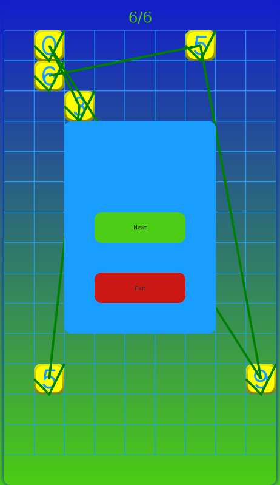
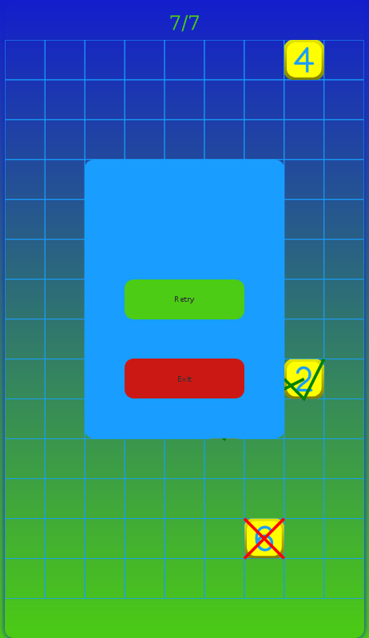

# Memory Recall Game PWA TypeScript

<a href="https://memoryrecall.turboignited.com">Play latest version</a>

## Introduction
The project uses barebone web technologies. It combines a canvas context with standard HTML elements that are displayed above any rendering performed on the canvas. There is a single container that is styled as a grid with the canvas and HTML elements as overlapping grid cells.
Most importantly, it supports resizing by scaling both layers without disturbing content already rendered by maintaining the ratio of the canvas and making use of transforms rather than altering the width and height properties which destroys rendered content.

Content is provided by subclassing View which handles passing the rendering context, hiding any previously shown view and allowing to provide a custom Layout. 

The game attempts to fit within a mobile screen whilst having a predetermined resolution to aid in design. The game view in this project shows how you can provide separate logic and be informed when the view is created, shown, rendered, hidden, and destroyed which in turn respectively create, start, draw, pause and quit the game.

## PWA Architecture
This projects loads all assets required by the game, providing a view and reporting on progress.
In production scenerario, after the user has initially loaded the game they can then play it offline.

<!-- 

 -->
<!-- 

 -->

## v0.9
Much has been done to create a good layout which works across many screen sizes and allows a consistent way to design layouts. The project has settled on a consistent 720x1280 pixel layout, it will be useful to easily change this as maintaining this resolution requires scaling. All content is concentrated in the container in the center. Viewing on a device with a lower resolution will scale this container to fit and likewise with a larger resolution device.

There is much more to do before v1.0, including incorporating online functionality, aiding with specifying colour, adjusting a few pixels here and there and last but not least, tests.

The service worker is enabled only when building for production and follows the guidelines specified by Google Lighthouse.

  
   
  
  
  

## Usage
npm start - launch webpack development server.
npm build - create production ready public folder.
npm test - run a jest watch environment for all test files with coverage.
npm serve - create production ready public folder and start a simple server. Useful for testing service worker locally.

<a href="https://memoryrecall.turboignited.com">Live Demo</a>

## TODO List
This project is continually being updated.
