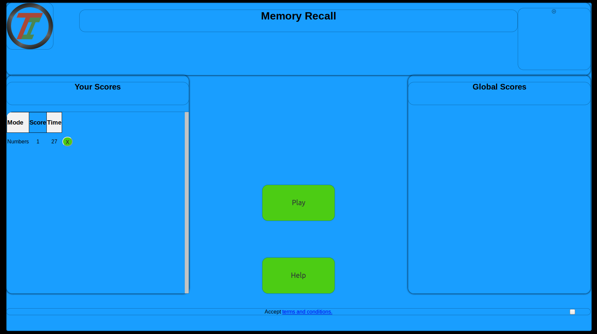
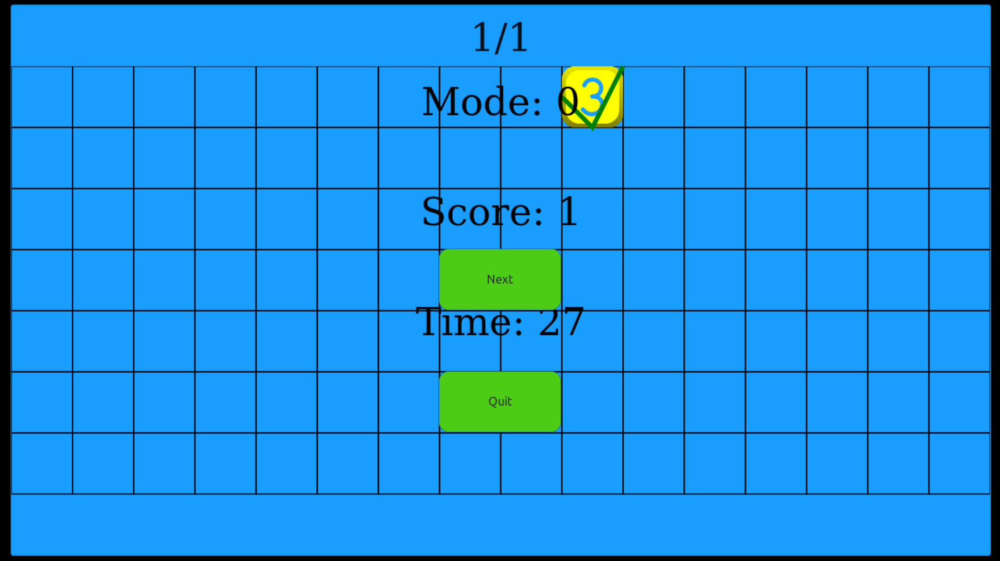
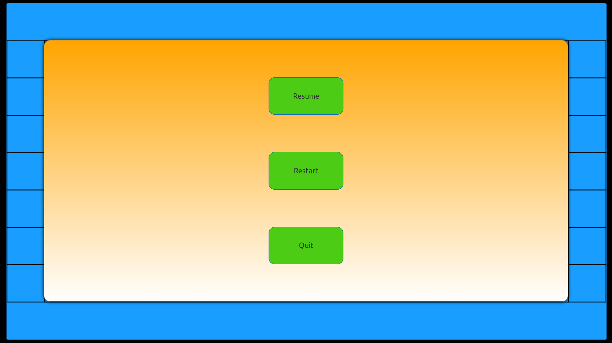

# Memory Recall Game PWA TypeScript

<!-- 

 -->
<!-- 

 -->

## Architecture
The main class instantiated on page load is App. Which checks for availability of a canvas 2d context and 
orchestrates necessary functionality during the lifetime.

As a PWA the app makes use of a barebones service worker as generated by the workbox-webpack-plugin.
This projects loads all assets required by the game, providing a view and reporting on progress.
After loading assets the game can be played offline.

## Testing
Testing is available through Jest, with canvas mocking and TypeScript.
npm run test

## Building
Building requires webpack to bundle the index.ts file. It is only when built that the service worker will be made available.
npm run build

## Developing
Developing requires the webpack-dev-server and supports reloading upon code changes.
npm run start

## TODO List
This project is continually being updated.