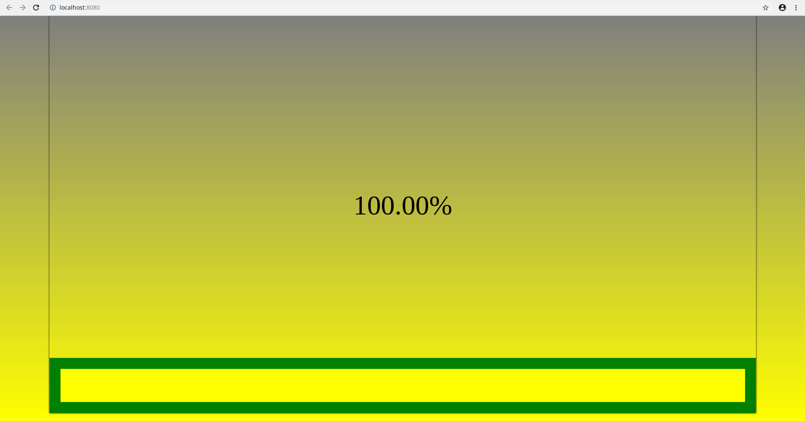
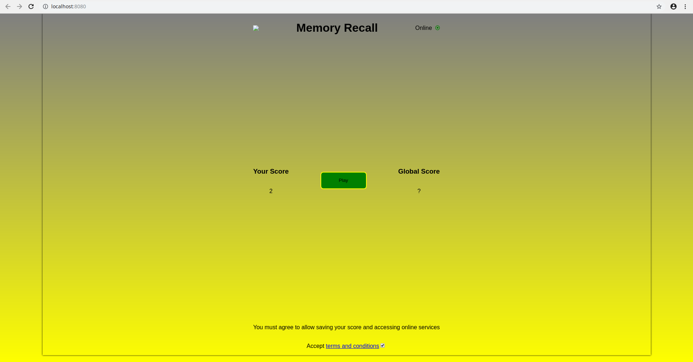
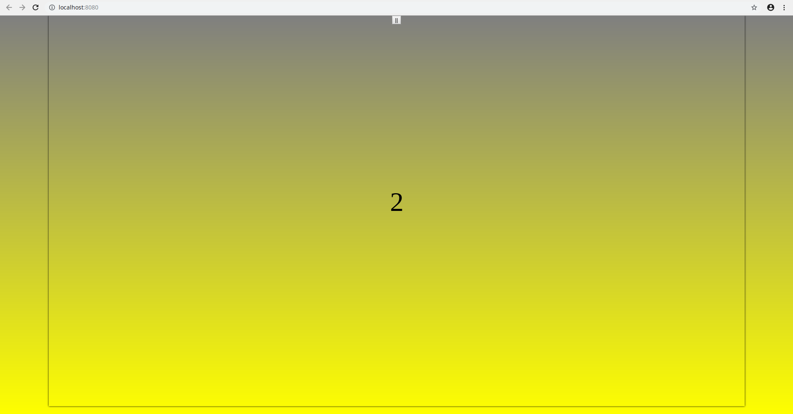
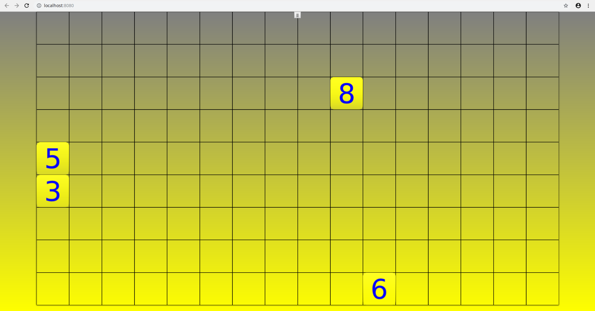
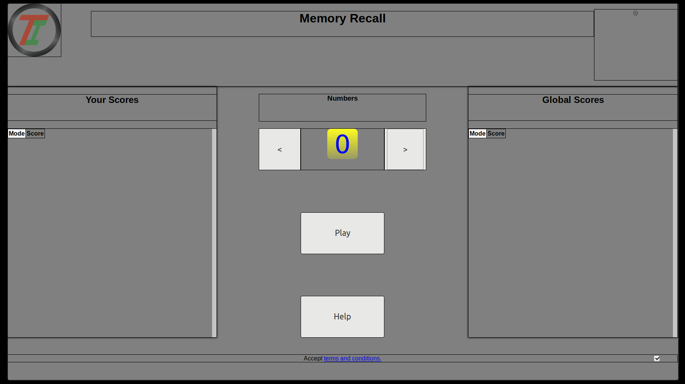
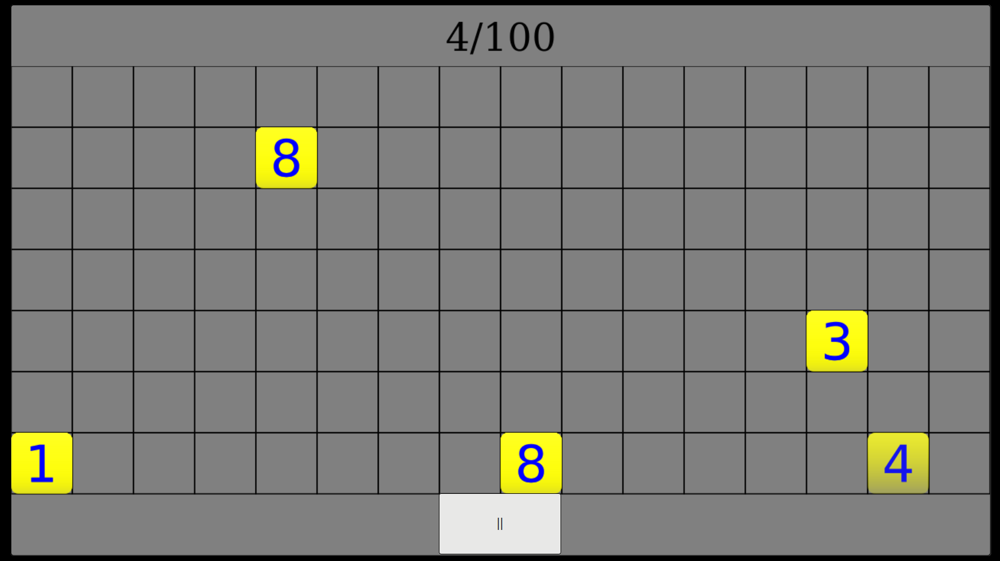
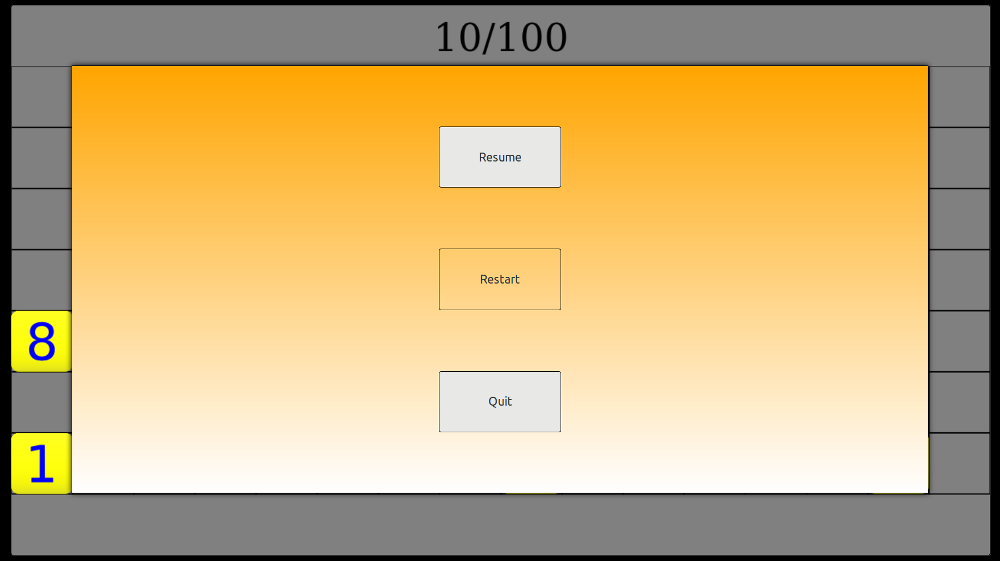
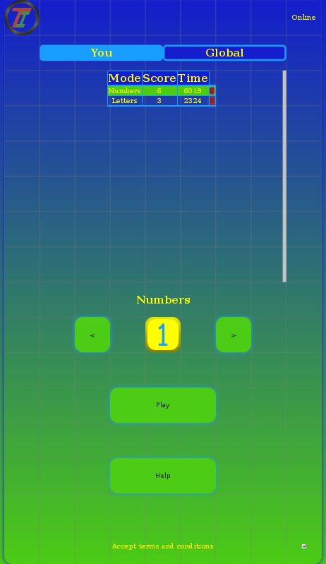
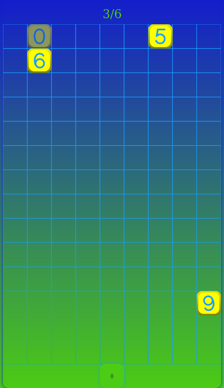
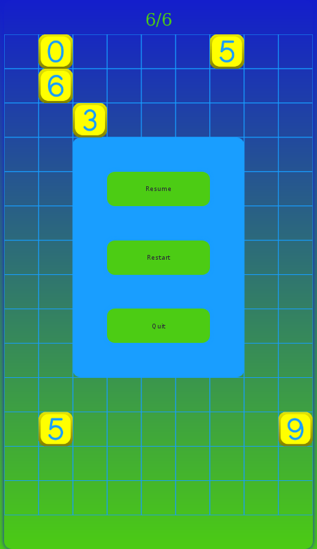

# Memory Recall Game PWA TypeScript

<!-- 

 -->
<!-- 

 -->

## v0.9
Much has been done to create a good layout which works across many screen sizes and allows a consistent way to design layouts. The project has settled on a consistent 720x1280 pixel layout, it will be useful to easily change this as maintaining this resolution requires scaling. There is much more to do before v1.0, including incorporating online functionality, aiding with specifying colour, adjusting a few pixels here and there and last but not least, tests.

The service worker is enabled only when building for production and follows the guidelines specified by Google Lighthouse.

## Usage
npm start - launch webpack development server.
npm build - create production ready public folder.
npm test - run a jest watch environment for all test files with coverage.
npm serve - create production ready public folder and start a simple server. Useful for testing service worker locally.

## Architecture
This projects loads all assets required by the game, providing a view and reporting on progress.
In production scenerario, after the user has initially loaded the game they can then play it offline.
Online functionality is reliant on the user accepting the terms and conditions.
The game attempts to fit within a mobile screen whilst having a predetermined resolution to aid in design.

## TODO List
This project is continually being updated.